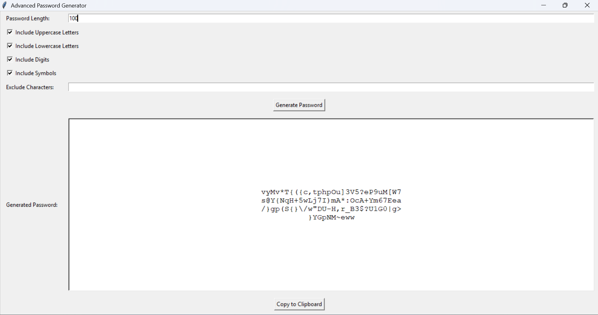

# 🔐 Advanced Password Generator (Tkinter)

A simple yet powerful **Password Generator GUI application** built with **Python (Tkinter)**.  
This tool allows you to generate secure random passwords with customizable options such as length, uppercase, lowercase, digits, symbols, and excluded characters.  

---

## ✨ Features
- ✅ Set custom password length  
- 🔠 Option to include **Uppercase letters**  
- 🔡 Option to include **Lowercase letters**  
- 🔢 Option to include **Digits (0-9)**  
- 🔣 Option to include **Symbols (!@#$%^&* etc.)**  
- 🚫 Exclude specific characters you don’t want  
- 📋 One-click **Copy to Clipboard** functionality  
- 🖥️ User-friendly **Tkinter GUI**  

---

## 📸 Screenshot

Example:  


---

## 🛠️ Installation & Usage

### 1. Clone the Repository
```bash
git clone https://github.com/VishnuKumarLH/OIBSIP_Python_Programming_Task3/
cd main.py
```

### 2. Run the Application
```bash
python main.py
```

---

## 📂 Project Structure
```
password-generator-tkinter/
│
├── main.py                 # Main Python script
├── README.md               # Project documentation
└── pass.png                # App screenshot 
```

---

## 🚀 How It Works
1. Enter the desired password **length**.  
2. Select the character types you want (uppercase, lowercase, digits, symbols).  
3. Optionally enter characters you want to **exclude**.  
4. Click **Generate Password** to create a random password.  
5. Copy it to your clipboard using the **Copy button**.  

---

## 📦 Requirements
- Python 3.x  

*(No external libraries needed — only `tkinter` and built-in modules)*  

---

## 🤝 Contributing
Pull requests are welcome. For major changes, please open an issue first to discuss what you would like to change.  

---

## 📜 License
This project is **open-source** and available under the [MIT License](LICENSE).  

---
👨‍💻 Developed with ❤️ using **Python & Tkinter**
